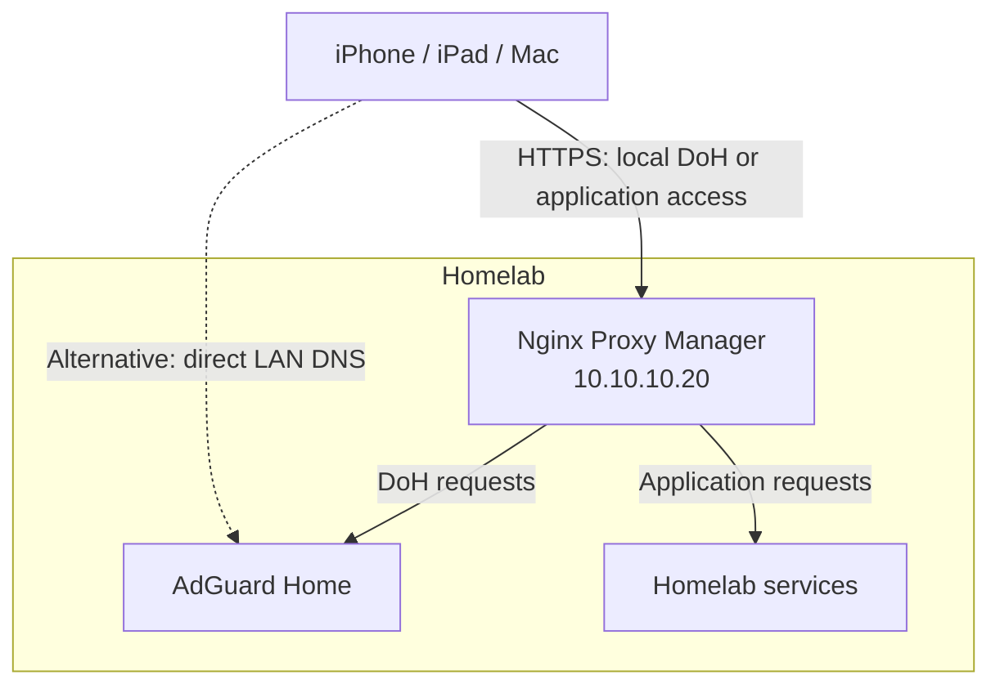
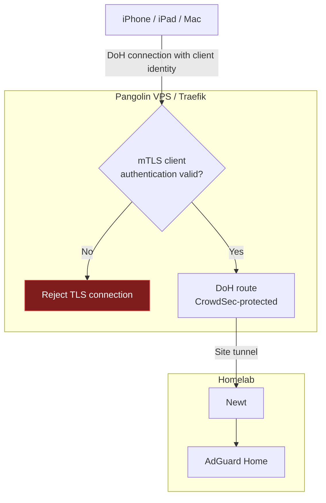
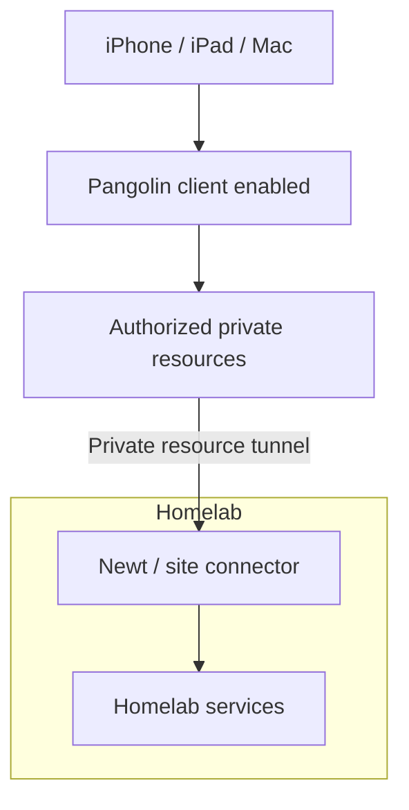

# Split-Horizon DNS and DoH with Pangolin and AdGuard Home

## Motivation

I want to use my home AdGuard resolver on my iPhone, iPad, and MacBook wherever I am. Its filtering rules and DNS configuration should remain available without keeping a WireGuard or other VPN tunnel active just for DNS. Reducing the always-on tunnel's potential battery overhead is part of that motivation; battery savings have not been measured here.

When I need an application inside my homelab, I enable the Pangolin client. That gives me access to the private resources assigned to my account. When I only need ordinary Internet access, authenticated DNS-over-HTTPS is enough.

At home, traffic stays local: AdGuard handles DNS and Nginx Proxy Manager (NPM) provides access to applications. Away from home, the VPS provides the DoH entry point, while Newt connects it to AdGuard. Newt stays connected in the homelab; the mobile device does not need a permanent tunnel.

> This is not a complete setup guide, feel free to adopt it to your own needs. It describes the rough idea and basic configuration.


## Architecture

The setup has three everyday modes. The diagrams show their main paths; response traffic follows the corresponding return path.

### Everyday internal use

On the home network, clients use AdGuard directly for DNS or reach its DoH endpoint through the local NPM instance. Internal application names resolve to NPM's LAN address, so application traffic stays inside the homelab.



For example, AdGuard answers `photos.home.example.net` with `10.10.10.20`. The client then opens a separate HTTPS connection to NPM. DNS resolution does not forward the application connection through AdGuard.

### Everyday mobile use

Away from home, the device uses `https://dns.example.net/dns-query/iphone`. Traefik checks the client certificate during the TLS handshake. Only a valid identity signed by the trusted client CA, with proof of possession of its private key, can proceed to the DoH route.



mTLS protects the **device-to-Traefik** connection. The site tunnel is a separate connection between the VPS side and Newt. AdGuard receives the DNS request through the configured backend listener. NPM is not part of this remote DoH path.

### Homelab access

When I need a homelab application remotely, I connect the Pangolin client. Pangolin's resource permissions determine which services I can reach.



This is a logical access path: the connection may be direct or relayed. Private HTTP/HTTPS resources can terminate HTTPS at the site connector; they do not imply public application access through VPS Traefik. See [Pangolin private HTTP/HTTPS resources](https://docs.pangolin.net/manage/resources/private/private-http).

## Setup overview

This guide starts with **working Pangolin, AdGuard Home, and NPM installations**, plus a connected Newt site. It describes the changes needed to join them together.

| Location | Existing components | Changes in this guide |
|---|---|---|
| VPS | Pangolin, Gerbil, Traefik | CrowdSec, mTLS DoH route, public/private resources, firewall and Traefik bouncers |
| Homelab | Newt, AdGuard Home, NPM | DNS rewrites, AdGuard clients, NPM certificate and DoH proxy host |
| Administration workstation and devices | Certificate tooling and Apple devices | Client CA, individual identities, Apple DoH profiles |

Read the setup in that order. The proxy configurations reference the client CA created in the final setup section. Prepare those changes first, then install the CA and bouncer keys before activating and testing the complete route. Do not temporarily expose DoH without authentication while preparing it.

### Example values and paths

| Example | Replace with |
|---|---|
| `pangolin.example.net` | Your Pangolin hostname |
| `dns.example.net` | Your dedicated DoH hostname |
| `photos.home.example.net` | One of your homelab application names |
| `203.0.113.10` | Your VPS IP; this example address is not routable |
| `10.10.10.20` | Your homelab NPM IP |
| `10.10.10.53:443` | AdGuard HTTPS / DoH listener in the homelab |
| `10.10.10.30:2283` | An example application backend |

Comments such as `# ./pangolin/config/traefik/dynamic_config.yml` identify files on the relevant host. They do not imply a shared filesystem between VPS and homelab. Compose mount sources are relative to the Compose file; absolute mount destinations are paths **inside containers**. Run commands from the parent of the indicated deployment directory on the relevant machine.

All YAML blocks are excerpts to merge into existing files. Preserve installer-generated Pangolin configuration, including Badger and dashboard/API routing; do not duplicate top-level keys.

The supplied deployment used Pangolin `ee-1.23.0`, Gerbil `1.5.1`, Traefik `v3.7`, Badger `v1.7.0`, and the Traefik CrowdSec plugin `v1.4.5`. These record the original setup, not a tested compatibility matrix for a fresh installation. The examples below have not been deployed against the live infrastructure while preparing this guide.

## VPS setup

The VPS handles the public endpoint and admission checks. It connects to the homelab through Newt; it does not run NPM or AdGuard.

### 1. Add CrowdSec to the Pangolin Compose stack

Keep the working Pangolin and Gerbil services. Add CrowdSec to their Docker network and ensure Traefik's configuration and access logs are mounted:

```yaml
# ./pangolin/docker-compose.yml
services:
  traefik:
    network_mode: service:gerbil
    env_file:
      - .env.netcup
    command:
      - --configFile=/etc/traefik/traefik_config.yml
    volumes:
      - ./config/traefik:/etc/traefik:ro
      - ./config/letsencrypt:/letsencrypt
      - ./config/traefik/logs:/var/log/traefik

  crowdsec:
    image: '${CROWDSEC_IMAGE:?Set a reviewed CrowdSec image tag or digest}'
    restart: unless-stopped
    ports:
      - '127.0.0.1:18080:8080'
    environment:
      COLLECTIONS: crowdsecurity/traefik
    volumes:
      - ./config/crowdsec:/etc/crowdsec
      - ./config/crowdsec/db:/var/lib/crowdsec/data
      - ./config/traefik/logs:/var/log/traefik:ro
```

Set `CROWDSEC_IMAGE` in the Compose environment to a reviewed, pinned `crowdsecurity/crowdsec` image. The loopback port is for the **host firewall bouncer**. The **Traefik bouncer** uses `crowdsec:8080` inside Docker. Keep LAPI off public interfaces and verify that it listens on the container interface.

Traefik shares Gerbil's network namespace here, so its public port mappings remain on Gerbil. Preserve the existing tunnel ports.

Tell CrowdSec where to read Traefik logs:

```yaml
# ./pangolin/config/crowdsec/acquis.d/traefik.yaml
filenames:
  - /var/log/traefik/access.log
labels:
  type: traefik
```

This enables the log-analysis path. AppSec/WAF requires additional integration; installing AppSec collections alone would not enable it.

### 2. Configure Traefik for mTLS DoH

There are two certificate roles: the ordinary HTTPS server certificate proves the identity of `dns.example.net`; the private client CA tells Traefik which **devices** it trusts.

#### Static configuration

Retain existing settings and merge the provider, plugin, certificate, and access-log configuration:

```yaml
# ./pangolin/config/traefik/traefik_config.yml
providers:
  http:
    endpoint: http://pangolin:3001/api/v1/traefik-config
    pollInterval: 5s
  file:
    filename: /etc/traefik/dynamic_config.yml
    watch: true

experimental:
  plugins:
    bouncer:
      moduleName: github.com/maxlerebourg/crowdsec-bouncer-traefik-plugin
      version: v1.4.5 # Original pin; review for your installed version.

entryPoints:
  web:
    address: ':80'
  websecure:
    address: ':443'

certificatesResolvers:
  letsencrypt:
    acme:
      email: admin@example.net
      storage: /letsencrypt/acme.json
      httpChallenge:
        entryPoint: web
  netcup:
    acme:
      email: admin@example.net
      storage: /letsencrypt/acme-netcup.json
      dnsChallenge:
        provider: netcup
        propagation:
          delayBeforeChecks: 600s

accessLog:
  filePath: /var/log/traefik/access.log
  format: json
  fields:
    defaultMode: keep
    headers:
      defaultMode: drop
```

The single-name DoH certificate uses the HTTP-01 resolver in this example. The Netcup resolver is available for domain configurations requiring DNS-01, including wildcard certificates; defining it alone does not request one.

```dotenv
# ./pangolin/.env.netcup
NETCUP_CUSTOMER_NUMBER=REPLACE_WITH_CUSTOMER_NUMBER
NETCUP_API_KEY=REPLACE_WITH_API_KEY
NETCUP_API_PASSWORD=REPLACE_WITH_API_PASSWORD
```

Use your provider's equivalent settings if you do not use Netcup. These names come from [lego's Netcup provider](https://go-acme.github.io/lego/dns/netcup/). Keep the credential file private.

#### Dynamic DoH route and client verification

The custom router references the backend service generated by Pangolin. Replace the example service name with the one identified in the next step. The `crowdsec` middleware is defined in VPS step 5.

```yaml
# ./pangolin/config/traefik/dynamic_config.yml
http:
  routers:
    adguard-doh-mtls:
      rule: 'Host(`dns.example.net`) && PathRegexp(`^/dns-query/[A-Za-z0-9_-]+$`) && (Method(`GET`) || Method(`POST`))'
      entryPoints:
        - websecure
      service: 2-AdGuard-DoH-Test-service@http # Replace with your generated service.
      middlewares:
        - crowdsec@file
      priority: 200
      tls:
        certResolver: letsencrypt
        options: doh-mtls@file

    adguard-doh-deny-other-paths:
      rule: 'Host(`dns.example.net`)'
      entryPoints:
        - websecure
      service: noop@internal
      priority: 190
      tls:
        options: doh-mtls@file

tls:
  options:
    doh-mtls:
      minVersion: VersionTLS12
      sniStrict: true
      clientAuth:
        caFiles:
          - /etc/traefik/certs/doh/doh-client-ca.crt
        clientAuthType: RequireAndVerifyClientCert
```

`RequireAndVerifyClientCert` rejects missing or untrusted client identities. HTTP routing happens only after TLS authentication. Keep every TLS router for this hostname on the same compatible policy: mTLS is selected by hostname/SNI, not by URL path. See [Traefik TLS options](https://doc.traefik.io/traefik/reference/routing-configuration/http/tls/tls-options/).

The first router admits only device-specific DoH paths. The second prevents other paths from reaching AdGuard through this hostname. Check actual generated priorities; the example numbers do not automatically outrank every router. Also audit alternate hostnames, HTTP routes, and ports.

### 3. Configure public and private Pangolin resources

These serve two different purposes:

| Resource | Purpose | Access control |
|---|---|---|
| Public HTTP/HTTPS resource backing DoH | Provides a Pangolin-generated service targeting AdGuard through Newt | The custom Traefik route requires mTLS |
| Private HTTP/HTTPS resources | Remote access to homelab applications | Connected Pangolin client and assigned resource permissions |

#### Public DoH backend

Configure the AdGuard target on the homelab's Newt site with scheme `https` and port `443`: `https://10.10.10.53:443` in this example. Use the backend TLS server name matching AdGuard's certificate and configure the issuing CA as trusted where required. The IP identifies the destination; it is not necessarily a name covered by the certificate.

Inspect the effective configuration through a private/authenticated Traefik dashboard or from the trusted Docker network. Find the generated service name and insert it into the custom DoH router. The original setup used `2-AdGuard-DoH-Test-service@http`; this name is installation-specific.

The custom router uses the generated **service**, not the generated router's authentication chain. A DNS client cannot complete Pangolin's browser login. The mTLS route must therefore be the only admitted public path to this backend.

Keep the generated service available while disabling, denying, or equivalently protecting every alternate router to it. Simply disabling a Pangolin resource may remove its service too. The supplied configuration does not establish which GUI setting accomplishes this on your version: verify the effective routes before exposure, including non-DoH paths. Do not leave a generic unauthenticated proxy to AdGuard.

Public DNS should point `dns.example.net` and `pangolin.example.net` to the VPS. Configure any application-domain records required by Pangolin separately. A wildcard record is not an access rule, and ordinary private host aliases need no public DNS record. Only publish AAAA records if IPv6 has the same working protection.

#### Private application resources

For each application, select the Newt site, destination scheme/address/port, and permitted users or roles. For example:

| Setting | Example |
|---|---|
| Resource type | Private HTTP/HTTPS |
| Hostname | `photos.home.example.net` |
| Site | Your homelab Newt site |
| Backend | `http://10.10.10.30:2283` |
| HTTPS | Enabled for the resource hostname |
| Access | Intended users or roles only |

This lets the remote connection go from the Pangolin client through the site connector to the application without passing through NPM. Plain private host aliases are another option, but they do not create a reverse proxy or server certificate automatically. See [Pangolin resources](https://docs.pangolin.net/manage/resources/understanding-resources).

Enable the client DNS handling needed for private names. If the connected client should also use AdGuard as its upstream, expose the AdGuard DNS listener as an authorized private resource and configure that upstream through the tunnel. See [private aliases and DNS behavior](https://docs.pangolin.net/manage/resources/private/alias).

### 4. Add the CrowdSec firewall bouncer

The firewall bouncer runs on the **VPS host** and applies CrowdSec IP decisions to its firewall. It is separate from the Traefik plugin.

Install the package matching your firewall using the [CrowdSec firewall-bouncer instructions](https://docs.crowdsec.net/u/bouncers/firewall/). On Debian/Ubuntu, after configuring the CrowdSec package repository, choose **one**:

```sh
# VPS host: choose the package for your firewall backend.
sudo apt install crowdsec-firewall-bouncer-nftables
# Alternatively, for an iptables setup:
# sudo apt install crowdsec-firewall-bouncer-iptables
```

Create a separate credential:

```sh
# Uses ./pangolin/docker-compose.yml on the VPS.
docker compose -f ./pangolin/docker-compose.yml exec crowdsec \
  cscli bouncers add vps-firewall
```

Merge these values into the package-installed bouncer configuration. The relative filename below identifies the file under the host's system configuration directory; it is not inside the Pangolin container.

```yaml
# ./etc/crowdsec/bouncers/crowdsec-firewall-bouncer.yaml
# Host file relative to /; preserve the package's other settings.
api_url: http://127.0.0.1:18080/
api_key: REPLACE_WITH_VPS_FIREWALL_BOUNCER_KEY
mode: nftables # Use iptables if that is the selected backend.
```

```sh
# VPS host: activate the configured firewall bouncer.
sudo systemctl enable --now crowdsec-firewall-bouncer
sudo systemctl restart crowdsec-firewall-bouncer
sudo systemctl status crowdsec-firewall-bouncer --no-pager
```

Verify the relevant input/forwarding paths and IPv6 behavior. Docker-published traffic may traverse different chains from host services; an input-only rule does not prove container coverage. The bouncer enforces decisions; local SSH attack detection additionally needs SSH log acquisition and suitable CrowdSec collections. The [Pangolin CrowdSec guide](https://docs.pangolin.net/self-host/community-guides/crowdsec) covers host-log integration.

### 5. Add the CrowdSec Traefik bouncer

The Traefik bouncer enforces decisions at the HTTP layer. Create its own key:

```sh
# Uses ./pangolin/docker-compose.yml on the VPS.
docker compose -f ./pangolin/docker-compose.yml exec crowdsec \
  cscli bouncers add traefik-doh
```

Store only the returned key in `./pangolin/config/traefik/crowdsec-bouncer.key`, readable by Traefik and protected from other users. Add the middleware referenced by the DoH router:

```yaml
# ./pangolin/config/traefik/dynamic_config.yml
http:
  middlewares:
    crowdsec:
      plugin:
        bouncer:
          enabled: true
          crowdsecMode: stream
          crowdsecLapiScheme: http
          crowdsecLapiHost: crowdsec:8080
          crowdsecLapiPath: /
          crowdsecLapiKeyFile: /etc/traefik/crowdsec-bouncer.key
```

Attach `crowdsec@file` to other intended HTTP routers, such as the Pangolin dashboard, while preserving their existing authentication middleware. Use the [plugin reference](https://github.com/maxlerebourg/crowdsec-bouncer-traefik-plugin) for release-specific settings.

DoH clients cannot solve interactive CAPTCHA challenges. Use a compatible blocking policy. TLS authentication failures occur before this HTTP middleware and may not appear in access logs. Configure access-log rotation and retain DNS-related logs only as long as needed.

## Homelab setup

The homelab provides DNS and local application access. All changes in this section belong to AdGuard and NPM on the home network.

### 1. Add AdGuard DNS rewrites

In AdGuard's DNS rewrite settings, add:

| Name | Answer |
|---|---|
| `*.home.example.net` | `10.10.10.20` |
| `dns.example.net` | `10.10.10.20` |

The first sends local application connections to NPM. The second lets local devices use NPM for the same DoH hostname that resolves to the VPS publicly. Add the zone apex separately if needed and check both A and AAAA responses.

A global rewrite is also visible to remote clients querying this AdGuard instance. It does not create a route into your LAN. When Pangolin is connected, its private-name resolution must take precedence or the returned address must have an authorized tunnel route.

The DoH hostname itself also needs reachable bootstrap resolution. Test Wi-Fi/cellular transitions: a cached LAN address can break remote DoH. If your device does not reliably switch endpoints, use separate profiles or keep the public DoH endpoint on all networks until local selection works.

### 2. Create AdGuard clients

Create a persistent client for each device under AdGuard's client settings:

| Client ID | DoH URL |
|---|---|
| `iphone` | `https://dns.example.net/dns-query/iphone` |
| `ipad` | `https://dns.example.net/dns-query/ipad` |
| `macbook` | `https://dns.example.net/dns-query/macbook` |

These IDs provide recognizable logs and per-client filtering settings. Authentication comes from mTLS, not the URL label. See [AdGuard client configuration](https://github.com/AdguardTeam/AdGuardHome/wiki/Clients).

AdGuard already serves HTTPS / DoH on port `443` in this setup. Both the Pangolin target and the local NPM proxy host connect to that HTTPS listener. No unencrypted-DoH setting is needed.

Keep AdGuard's HTTPS listener reachable only through the intended homelab paths. Its server certificate is separate from the device certificates used for mTLS at Traefik and NPM. See [AdGuard configuration](https://github.com/AdguardTeam/AdGuardHome/wiki/Configuration).

### 3. Obtain the NPM server certificate

In NPM's SSL Certificates section, obtain a certificate for `dns.example.net`. DNS-01 lets you do this without exposing NPM to the Internet. Configure the DNS provider credentials and select this certificate on the proxy host in the next step.

The certificate on NPM and the certificate on VPS Traefik can be issued independently for the same hostname. Their private keys do not need to be synchronized. The NPM certificate is a **server** certificate; the client CA added later is a separate trust configuration. See [Let's Encrypt challenge types](https://letsencrypt.org/docs/challenge-types/).

### 4. Create the NPM DoH proxy host

| Setting | Value |
|---|---|
| Domain | `dns.example.net` |
| Forward scheme | `https` |
| Forward address | `10.10.10.53` |
| Forward port | `443` |
| SSL certificate | The certificate from the previous step |
| Exposure | LAN only |

Keep the AdGuard administration interface on a separate LAN/private management path. The dedicated DNS hostname should forward only DoH requests.

To require the same client identity locally, mount the public client CA into NPM after creating it in the next section:

```yaml
# ./npm/docker-compose.yml
# Merge into your actual NPM service name.
services:
  app:
    volumes:
      - ./certs/doh-client-ca.crt:/etc/nginx/doh/doh-client-ca.crt:ro
```

Paste this into the dedicated proxy host's **Advanced** field. The suggested file is a saved copy of the snippet, not an automatically loaded NPM file:

```nginx
# ./npm/snippets/doh-advanced.conf
ssl_client_certificate /etc/nginx/doh/doh-client-ca.crt;
ssl_verify_client on;
ssl_verify_depth 2;

if ($uri !~ "^/dns-query/[A-Za-z0-9_-]+$") {
    return 404;
}
if ($request_method !~ "^(GET|POST)$") {
    return 405;
}
```

For the HTTPS upstream, configure the TLS server name and certificate verification to match AdGuard's certificate; selecting `https` alone does not establish verified upstream identity. Keep the upstream destination independent of the split-DNS frontend name so it cannot resolve back to NPM.

Check the generated NGINX configuration and run `nginx -t` inside NPM. These directives belong in the proxy host's server context. Test that other paths cannot reach AdGuard. See [NPM advanced configuration](https://nginxproxymanager.com/advanced-config/) and [NGINX client authentication](https://nginx.org/en/docs/http/ngx_http_ssl_module.html).

## DoH client certificates and Apple devices

The server-side configuration is now prepared. Next, create the client CA, install its public certificate on both proxies, and give each device its own identity.

### 1. Create a dedicated client CA

Run this on a trusted administration workstation with OpenSSL 3, not inside the VPS containers. If you already have a suitable client PKI, use its issuance workflow instead. Run the CA-creation command once; do not overwrite an existing CA when adding another device.

```sh
# Creates private issuance material under ./private/pki/ on your workstation.
umask 077
mkdir -p ./private/pki
openssl req -x509 -newkey rsa:3072 -sha256 -days 3650 \
  -keyout ./private/pki/doh-client-ca.key \
  -out ./private/pki/doh-client-ca.crt \
  -subj '/CN=Homelab DoH Client CA' \
  -addext 'basicConstraints=critical,CA:TRUE,pathlen:0' \
  -addext 'keyUsage=critical,keyCertSign,cRLSign'
```

OpenSSL prompts for a password protecting the CA private key. Keep that key offline or in protected issuance storage. Copy only `doh-client-ca.crt` to:

| Destination | File |
|---|---|
| VPS | `./pangolin/config/traefik/certs/doh/doh-client-ca.crt` |
| Homelab NPM host | `./npm/certs/doh-client-ca.crt` |

With the CA and bouncer keys in place, activate the prepared Compose/Traefik/NPM changes. Static Traefik changes require a restart; Compose mount/environment changes require container recreation. Verify logs before installing the device profile.

### 2. Issue one identity per device

Create a client-certificate extension file:

```ini
# ./private/pki/client.ext
basicConstraints=critical,CA:FALSE
keyUsage=critical,digitalSignature
extendedKeyUsage=clientAuth
subjectKeyIdentifier=hash
authorityKeyIdentifier=keyid,issuer
```

Issue the iPhone identity; repeat with distinct filenames and names for the iPad and MacBook:

```sh
# Creates the iphone identity under ./private/pki/.
umask 077
openssl req -new -newkey rsa:2048 -noenc \
  -keyout ./private/pki/iphone.key \
  -out ./private/pki/iphone.csr \
  -subj '/CN=iphone'

openssl x509 -req -sha256 -days 365 \
  -in ./private/pki/iphone.csr \
  -CA ./private/pki/doh-client-ca.crt \
  -CAkey ./private/pki/doh-client-ca.key \
  -CAserial ./private/pki/doh-client-ca.srl -CAcreateserial \
  -extfile ./private/pki/client.ext \
  -out ./private/pki/iphone.crt

openssl verify -purpose sslclient \
  -CAfile ./private/pki/doh-client-ca.crt ./private/pki/iphone.crt

openssl pkcs12 -export \
  -inkey ./private/pki/iphone.key \
  -in ./private/pki/iphone.crt \
  -certfile ./private/pki/doh-client-ca.crt \
  -name iphone-doh \
  -out ./private/pki/iphone.p12
```

The device key is unencrypted on disk for packaging, protected here by file permissions; store it securely. The PKCS#12 export prompts for its own password. The CA serial file tracks issuance; preserve it and do not run this simple issuance workflow concurrently. See [OpenSSL signing](https://docs.openssl.org/3.0/man1/openssl-x509/) and [PKCS#12 packaging](https://docs.openssl.org/3.0/man1/openssl-pkcs12/).

### 3. Install an Apple DoH profile

Apple supports selecting a DNS resolver client identity on iOS/iPadOS 16+ and macOS 13+. The profile connects that identity to the device-specific DoH URL. It does not require a general-purpose trust installation of the client CA when the HTTPS servers already use publicly trusted certificates.

The profile combines a PKCS#12 identity payload with a DNS Settings payload. `DNSSettings.PayloadCertificateUUID` must reference the UUID of that identity payload. Merely installing both payloads is insufficient. See [Apple DNS settings](https://developer.apple.com/documentation/devicemanagement/dnssettings/dnssettings-data.dictionary) and [PKCS#12 certificate payloads](https://developer.apple.com/documentation/devicemanagement/certificatepkcs12).

The example helper below generates a profile using the Python standard library. Save it as `./scripts/create-doh-mobileconfig.py`.

<details>
<summary>Profile generator: create-doh-mobileconfig.py</summary>

```python
# ./scripts/create-doh-mobileconfig.py
import argparse
import getpass
import os
from pathlib import Path
import plistlib
import re
import uuid

parser = argparse.ArgumentParser(description="Create an Apple mTLS DoH profile")
parser.add_argument("client_id")
parser.add_argument("pkcs12", type=Path)
parser.add_argument("output", type=Path)
parser.add_argument("--hostname", default="dns.example.net")
args = parser.parse_args()
if not re.fullmatch(r"[A-Za-z0-9_-]+", args.client_id):
    parser.error("client_id must contain only letters, digits, underscores or hyphens")
if not re.fullmatch(r"[A-Za-z0-9.-]+", args.hostname):
    parser.error("hostname must be a DNS hostname, without a scheme, port or path")

os.umask(0o077)
identity_uuid = str(uuid.uuid4()).upper()
base = f"net.example.doh.{args.client_id}"

def payload(kind, identifier, name, payload_uuid=None):
    return {
        "PayloadType": kind,
        "PayloadVersion": 1,
        "PayloadIdentifier": identifier,
        "PayloadUUID": payload_uuid or str(uuid.uuid4()).upper(),
        "PayloadDisplayName": name,
    }

identity = payload("com.apple.security.pkcs12", base + ".identity",
                   "DoH client identity", identity_uuid)
identity["PayloadContent"] = args.pkcs12.read_bytes()
identity["Password"] = getpass.getpass("PKCS#12 export password: ")

dns = payload("com.apple.dnsSettings.managed", base + ".dns", "Homelab DoH")
dns["DNSSettings"] = {
    "DNSProtocol": "HTTPS",
    "ServerURL": f"https://{args.hostname}/dns-query/{args.client_id}",
    "PayloadCertificateUUID": identity_uuid,
}
dns["OnDemandRules"] = [{"Action": "Connect"}]

profile = payload("Configuration", base, f"Homelab DoH ({args.client_id})")
profile["PayloadContent"] = [identity, dns]
profile["PayloadRemovalDisallowed"] = False
args.output.parent.mkdir(parents=True, exist_ok=True)
# Exclusive creation avoids silently replacing an existing device profile.
with args.output.open("xb") as stream:
    plistlib.dump(profile, stream, fmt=plistlib.FMT_XML, sort_keys=False)
print(f"Created {args.output}")
```

</details>

```sh
# Uses ./scripts/create-doh-mobileconfig.py and private device credentials.
python3 ./scripts/create-doh-mobileconfig.py \
  iphone ./private/pki/iphone.p12 ./private/profiles/iphone.mobileconfig \
  --hostname dns.example.net

# On macOS, check the generated property list.
plutil -lint ./private/profiles/iphone.mobileconfig
```

The generated file contains both the encrypted identity and its password. Treat the **entire profile as a secret**. The helper does not validate the PKCS#12 password or certificate and does not sign the profile. Verify the identity before distribution; use MDM or an authenticated private transfer mechanism. Profile signing can establish provenance but does not by itself encrypt its contents.

Install the profile through the device's profile-management flow and enable the DNS configuration where required. Repeat with separate identities for each device. The example applies broadly because it has no domain restriction. Network extensions, VPN DNS, managed policy, and applications with their own DNS can change effective behavior; verify on the target OS.

### 4. Verify the complete setup

Check the server configuration and CrowdSec connections on the VPS:

```sh
# Uses ./pangolin/docker-compose.yml; -q avoids printing resolved secrets.
docker compose -f ./pangolin/docker-compose.yml config -q
docker compose -f ./pangolin/docker-compose.yml logs --tail=100 traefik
docker compose -f ./pangolin/docker-compose.yml exec crowdsec cscli metrics
docker compose -f ./pangolin/docker-compose.yml exec crowdsec cscli bouncers list
```

From an external network with Pangolin disconnected, verify that the public endpoint rejects a connection without a client certificate:

```sh
# Substitute the real VPS address for 203.0.113.10.
curl --verbose --connect-timeout 10 --max-time 20 \
  --resolve dns.example.net:443:203.0.113.10 \
  https://dns.example.net/dns-query/iphone
```

Then send an actual DNS query using the test identity. The following GET encodes an A query for `example.com`:

```sh
# Reads the test identity from ./private/pki/ on your workstation.
mkdir -p ./private/tests
curl --fail-with-body --show-error --max-time 20 \
  --resolve dns.example.net:443:203.0.113.10 \
  --cert ./private/pki/iphone.crt \
  --key ./private/pki/iphone.key \
  --header 'Accept: application/dns-message' \
  --dump-header ./private/tests/doh-headers.txt \
  --output ./private/tests/doh-response.bin \
  'https://dns.example.net/dns-query/iphone?dns=AAABAAABAAAAAAAAB2V4YW1wbGUDY29tAAABAAE'
```

Expect HTTP 200, `Content-Type: application/dns-message`, a valid DNS response, and the corresponding client entry in AdGuard's query log. An empty GET returning 400 only proves that an HTTP endpoint answered. See [RFC 8484](https://www.rfc-editor.org/info/rfc8484/).

Repeat on the LAN with `--resolve dns.example.net:443:10.10.10.20`, both with and without credentials. Do not use `-k`; server certificate validation is part of the test. Check untrusted/expired identities and verify that `/`, `/control/status`, and unexpected DoH paths cannot reach AdGuard. Check alternate routes and IPv6 too.

Finally, test the three modes on an actual device:

| Mode | Expected result |
|---|---|
| Everyday internal use | DNS uses the intended LAN path; applications open through NPM |
| Everyday mobile use, Pangolin off | DoH works through the VPS; private applications remain inaccessible |
| Homelab access, Pangolin on | Authorized private resources resolve and open through the tunnel |

Switch between Wi-Fi and cellular in both directions, then test sleep/wake and resolver outage behavior. Correlate device lookups with the logs; plain `dig` does not necessarily follow Apple's scoped system DNS settings.

### Troubleshooting and maintenance

| Symptom | First check |
|---|---|
| Certificate rejected | Issuing CA, expiry, client-auth usage, and profile identity UUID |
| DoH works without an identity | Alternate routers, conflicting TLS options, HTTP entry points, or IPv6 bypass |
| Login HTML or redirects instead of DNS | Generated browser-auth router or CAPTCHA middleware selected |
| 502/504 from the DoH route | Newt status, AdGuard HTTPS listener on port 443, and backend TLS name/trust |
| Fails after leaving home | Cached private address for the DoH endpoint |
| Internal name resolves but application fails | Pangolin resource permission, route, and client DNS precedence |
| CrowdSec sees no traffic | Log acquisition, collection, permissions, and parser metrics |

Keep device identities, PKCS#12 files, generated profiles, DNS API secrets, CA keys, bouncer keys, and ACME state out of public repositories. Profiles contain usable private credentials. Protect DNS logs too: the resolver and TLS terminator can observe queries.

Record certificate expiry dates and replace device profiles before expiration. The URL client ID is not bound to the certificate by this configuration, so an accepted device could use another client's label.

The shared-CA configuration shown here does not provide individual certificate revocation. Removing a profile does not invalidate a stolen copy. Add and test a supported revocation/authorization mechanism if immediate per-device revocation is required; otherwise an emergency can require CA replacement and reissuing all identities. Existing TLS sessions also need consideration.

After updates or Pangolin resource changes, recheck the generated service reference, mTLS rejection, and route isolation. Retain a local method to disable a broken DNS profile.

## References and further reading

Links checked while preparing this guide on 2026-09-23. Product documentation may evolve independently of the recorded deployment versions.

### Pangolin and Newt

- [Pangolin documentation](https://docs.pangolin.net/manage/resources/understanding-resources) — resource types and access model.
- [Private HTTP/HTTPS resources](https://docs.pangolin.net/manage/resources/private/private-http) — private web access and site-side TLS.
- [Private resource aliases](https://docs.pangolin.net/manage/resources/private/alias) — private names and DNS overrides.
- [Install the site connector (Newt)](https://docs.pangolin.net/manage/sites/install-site) — connecting the homelab.
- [Pangolin configuration file](https://docs.pangolin.net/self-host/advanced/config-file) — configuration reference.
- [Pangolin CrowdSec community guide](https://docs.pangolin.net/self-host/community-guides/crowdsec) — integration and operational notes.

### Traefik and CrowdSec

- [Traefik TLS options](https://doc.traefik.io/traefik/reference/routing-configuration/http/tls/tls-options/) — SNI, client authentication, and conflicting options.
- [CrowdSec firewall bouncer](https://docs.crowdsec.net/u/bouncers/firewall/) — host-level IP blocking.
- [CrowdSec Traefik integration](https://docs.crowdsec.net/u/bouncers/traefik/) — supported integration overview.
- [CrowdSec Traefik bouncer plugin](https://github.com/maxlerebourg/crowdsec-bouncer-traefik-plugin) — plugin settings, secret files, and AppSec.

### DNS, reverse proxies, and certificates

- [AdGuard Home configuration](https://github.com/AdguardTeam/AdGuardHome/wiki/Configuration) — version-dependent YAML settings.
- [AdGuard Home clients](https://github.com/AdguardTeam/AdGuardHome/wiki/Clients) — client IDs and per-client settings; the page also links to the newer knowledge base.
- [Nginx Proxy Manager advanced configuration](https://nginxproxymanager.com/advanced-config/) — custom NGINX configuration.
- [NGINX SSL module](https://nginx.org/en/docs/http/ngx_http_ssl_module.html) — client certificate verification.
- [Let's Encrypt challenge types](https://letsencrypt.org/docs/challenge-types/) — HTTP-01 and DNS-01.
- [lego Netcup provider](https://go-acme.github.io/lego/dns/netcup/) — DNS API credential names.
- [RFC 8484: DNS Queries over HTTPS](https://www.rfc-editor.org/info/rfc8484/) — DoH protocol and message format.

### Apple clients

- [Apple DNS Settings payload](https://developer.apple.com/documentation/devicemanagement/dnssettings) — configuration profile payload.
- [Apple DNSSettings dictionary](https://developer.apple.com/documentation/devicemanagement/dnssettings/dnssettings-data.dictionary) — resolver URL, bootstrap addresses, and client identity reference.
- [Apple PKCS#12 payload](https://developer.apple.com/documentation/devicemanagement/certificatepkcs12) — device identity import.
- [Apple device-management DNS schema](https://github.com/apple/device-management/blob/release/mdm/profiles/com.apple.dnsSettings.managed.yaml) — machine-readable payload definition.

### Certificate tooling

- [OpenSSL certificate requests](https://docs.openssl.org/3.0/man1/openssl-req/) — CA and device request creation.
- [OpenSSL certificate signing](https://docs.openssl.org/3.0/man1/openssl-x509/) — signing device certificates.
- [OpenSSL PKCS#12](https://docs.openssl.org/3.0/man1/openssl-pkcs12/) — packaging client identities.
